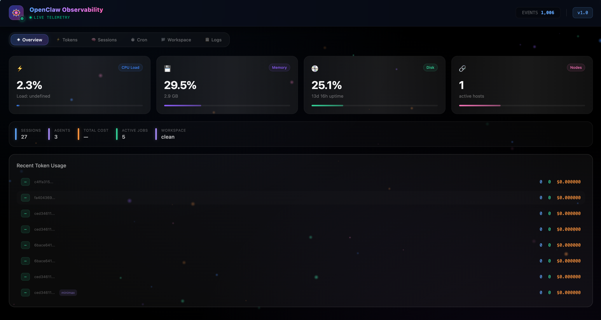

#  OpenClaw O11y (Observability)

Welcome to **OpenClaw O11y** — the telemetry dashboard for your OpenClaw AI Agents. 

Stop SSH-ing into your VMs just to `tail -f` a `.jsonl` file. Stop guessing how many tokens your latest prompt burned. OpenClaw O11y gives you a real-time, cyberpunk-styled window directly into the "brains" of your AI workforce. 



---

## ✨ Features

- 🧠 **Deep Thought & Timeline Inspection**: Expandable panels for LLM inner monologues and tool calls.
- 💰 **Live Token Economy**: Real-time tracking of Input, Output, and Cache tokens with Cost (USD) metrics.
- 🗂️ **Multi-Agent Workspace Explorer**: Dynamic `.md` and `.json` file cards across all your `workspace*` directories.
- ⏱️ **Cron Job Telemetry**: Deep execution history (up to 5,000 runs) with accordion-style expandable summaries.
- 📊 **Live System & Log Tailing**: 60-second hardware metrics (CPU/RAM/Disk) and streaming JSON log parser.
- 🌍 **Distributed Monitoring**: Drop a lightweight Go binary on any remote node to instantly stream telemetry to your central dashboard.

---

## 🏗️ Architecture

O11y isn't a monolith; it's designed to be distributed. It consists of three parts:

1. **The Probe (`clawo11y-agent`)**: A lightweight, blazing-fast Go binary that lives on your Agent's host machine. It uses `fsnotify` to watch file changes and pushes data up.
2. **The Brain (`core.server`)**: A Python FastAPI server backed by SQLite. It aggregates data from multiple probes and broadcasts it via WebSockets.
3. **The Glass (`web`)**: A React/Vite frontend bathed in Tailwind CSS glassmorphism and neon gradients.

---

## 🚀 Deployment Guide

Choose the setup that best fits your environment.

### 1️⃣ Quick Start (Docker Compose)
*The fastest way to get everything running in isolated containers. Recommended for most users.*

We provide pre-built container images via GHCR. You can pull and run the entire stack (Server + Web + Agent) with two commands:

```bash
# Download the docker-compose file
curl -O https://raw.githubusercontent.com/danl5/clawo11y/main/docker-compose.yml

# Spin it up!
docker-compose up -d
```
> **Note:** The `docker-compose.yml` mounts `~/.openclaw` into the Agent container. Adjust the path in the file if your OpenClaw workspace is located elsewhere!

Access your dashboard at **[http://localhost:8000](http://localhost:8000)**.

---

### 2️⃣ Local Development (Bare-metal)
*Run directly on your host machine without Docker. Perfect for local dev, tinkering, and modifying the source code.*

Clone the repository and run our automated setup script:
```bash
git clone https://github.com/danl5/clawo11y.git
cd clawo11y

chmod +x start.sh
./start.sh
```
This single script will automatically:
1. Compile the Vite/React frontend.
2. Compile the Go binary `clawo11y-agent`.
3. Create a Python `.venv`, install dependencies, and spin up the FastAPI server.
4. Launch the Go agent in the background to start pumping telemetry data.

Press `Ctrl+C` to gracefully shut down both the server and the agent.

---

### 3️⃣ Distributed Monitoring (Bare-Metal Production)
*For a robust, daemonized deployment across multiple nodes without Docker.*

If you are running the "Overlord Architecture" where your central O11y Server is running elsewhere, you can deploy the Server and lightweight Go Agent as native Systemd services.

#### 1. The Server & Web Frontend
The FastAPI server is designed to serve the built React files statically. You don't need a separate Node.js server.

If your code is located at `/opt/clawo11y`, follow these steps:

```bash
# 1. Build the frontend
cd /opt/clawo11y/web && npm install && npm run build

# 2. Setup Python env (requires python3-venv)
cd /opt/clawo11y
python3 -m venv .venv
source .venv/bin/activate
pip install -r requirements.txt

# 3. Setup systemd (If your path is not /opt/clawo11y, edit the paths in scripts/o11y-server.service)
sudo cp scripts/o11y-server.service /etc/systemd/system/
sudo systemctl daemon-reload
sudo systemctl enable --now o11y-server
```

#### 2. The Go Agent (On Worker Nodes)
You only need to deploy the Go Agent on your remote OpenClaw workers.

1. Head to the [Releases Page](https://github.com/danl5/clawo11y/releases) and download the pre-compiled binary for your worker's OS/Arch.
2. Configure and enable the Systemd service:
```bash
# 1. Edit the environment variables in the service file
nano scripts/o11y-agent.service
# Set: Environment="O11Y_SERVER_URL=http://<YOUR_CENTRAL_SERVER_IP>:8000"

# 2. Setup systemd
sudo cp scripts/o11y-agent.service /etc/systemd/system/
sudo systemctl daemon-reload
sudo systemctl enable --now o11y-agent
```

> *Pro-tip: Check logs anytime using: `journalctl -fu o11y-server` or `journalctl -fu o11y-agent`*

---

## ⚙️ Configuration (Environment Variables)

Both the Agent and Server support environment variables for easy configuration without changing code.

### Agent (`clawo11y-agent`)
| Variable | Default | Description |
|---|---|---|
| `O11Y_SERVER_URL` | `http://127.0.0.1:8000` | The address of your central O11y FastAPI server. |
| `OPENCLAW_BASE_DIR` | `~/.openclaw` | The root directory where your Agent's `workspace`, `cron`, and `logs` live. |
| `GATEWAY_LOG_DIR` | `<OPENCLAW_BASE_DIR>/logs` | Optional explicit directory for gateway log collection. If unset and `<OPENCLAW_BASE_DIR>/logs` does not exist, the agent falls back to `/tmp/openclaw`. |

### Server (`core.server.main`)
| Variable | Default | Description |
|---|---|---|
| `O11Y_DB_URL` | `sqlite:///./o11y_server.db` | Connection string for the telemetry database. |

---

## 🛠️ Hacking & Modifying

```bash
# Terminal 1: Python Backend
python -m core.server.main

# Terminal 2: React Hot-Reload
cd web
npm run dev

# Terminal 3: Go Agent
cd clawo11y-agent
go run .
```

---

## 📝 Data Retention
- The Python Server uses SQLite (`o11y_server.db`).
- **Agent Events** (Timeline): Retains the latest 1,000 events in memory snapshots to prevent browser lag.
- **Cron Runs**: The Go Agent parses the latest 5,000 runs per job directly from `.jsonl` files on startup, ensuring you never lose context after a reboot.

---
*Happy observing. May your cache hit rates be high and your hallucinations be low.* 
