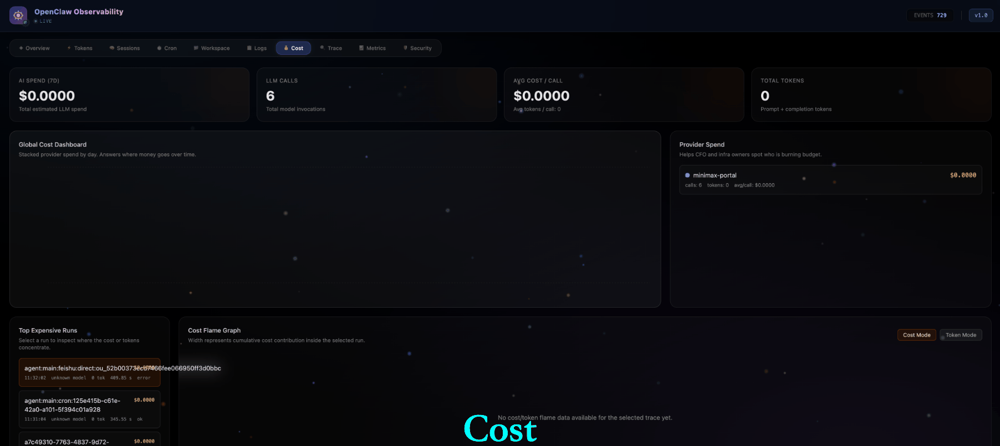

#  OpenClaw O11y

[](https://github.com/danl5/clawo11y/actions/workflows/run-test.yml)
[](https://goreportcard.com/report/github.com/danl5/clawo11y/services/server)
[](https://opentelemetry.io/)
[](https://openclaw.ai/)
[](https://opensource.org/licenses/MIT)

OpenClaw O11y is an observability stack for OpenClaw agents.

It combines:

- **Agent**: a lightweight Go agent that watches local OpenClaw state and hosts a local OTLP proxy
- **Server**: a central Go server that receives both native OpenClaw events and OTLP telemetry, stores them, aggregates data, and serves dashboards
- **Web**:  a React frontend focused on AI-agent business views instead of raw telemetry plumbing
- **Plugin**:  an optional OpenClaw plugin (`openclaw-otel-plugin`) that emits rich OpenTelemetry traces, metrics, and logs from inside the agent runtime

The goal is not just to show metrics/logs/traces. The goal is to answer questions like:

- Which run burned the most money?
- Which model is expensive or unstable?
- Which tool is slow or failing?
- Did a session start looping and expanding context?
- Did the agent execute risky shell or filesystem operations?



---

## What It Does

OpenClaw O11y currently provides two layers of observability:

- **Runtime event views**
  - overview, tokens, sessions, cron, workspace, and live logs
- **OTel-native agent observability**
  - trace call trees
  - cost dashboard
  - metrics dashboard
  - observability health
  - security timeline
  - context bloat candidates

---

## Product Views

### FinOps for AI

- **Cost Dashboard**
  - total spend, calls, tokens, average cost per call
  - provider-stacked daily cost trend
  - model cost breakdown
- **Top Expensive Runs**
  - surfaces the highest-cost sessions directly from root trace summaries
- **Cost Flame Graph**
  - renders a selected trace in `cost` mode or `token` mode
- **Context Bloat Alert**
  - flags sessions whose prompt-token growth suggests runaway loops or exploding context

### Agent Debugging

- **Deep Trace View**
  - root run summaries
  - nested LLM / tool / subagent spans
  - duration, model, provider, cost, tokens, errors, params, outputs
- **Tool Reliability Matrix**
  - calls, errors, error rate, average latency, P95 latency, max latency
- **Observability Health**
  - root recreation
  - orphan events
  - idle-timeout closures
  - lifecycle anomalies emitted by the plugin itself

### Security & Compliance

- **High-Risk Operation Timeline**
  - classifies risky tool calls into categories such as shell, code execution, filesystem mutation, and network access
  - shows risk class, reason, params preview, duration, and error state

---

## Architecture

The stack has four moving parts:

1. **OpenClaw runtime**
   - emits native runtime events such as `llm_input`, `llm_output`, `before_tool_call`, `after_tool_call`, `subagent_*`, `agent_end`
2. **OpenClaw OTEL plugin**
   - converts runtime events into OTLP traces, metrics, and logs
   - sends them to the local OTLP proxy on the worker host
3. **Go agent**
   - watches local OpenClaw files and logs
   - forwards OTLP payloads to the central server
   - collects node metrics
4. **Go server + React web**
   - receives OTLP and event data
   - stores it in SQLite
   - serves business-oriented dashboards and WebSocket updates

High-level flow:

```text
OpenClaw Runtime
  -> openclaw-otel-plugin
  -> local OTLP proxy on clawo11y-agent
  -> central clawo11y server
  -> SQLite + aggregations
  -> React dashboards
```

---

## Key Repositories and Paths

- `services/agent`
  - worker-side Go process
- `services/server`
  - central API server, OTLP receiver, aggregation layer
- `services/web`
  - React frontend
- `openclaw-otel-plugin`
  - OpenClaw plugin that emits traces, metrics, and logs
- `scripts/o11y-agent.service`
  - systemd example for the worker agent
- `scripts/o11y-server.service`
  - systemd example for the central server

---

## Deployment

Choose the mode that fits your setup.

### 1. Quick Start (Docker Compose)

Use this mode when you want the fastest single-host experience for evaluation or demos.

```bash
git clone https://github.com/danl5/clawo11y.git
cd clawo11y

docker compose up -d
```

This starts:

- the central server + web UI
- the worker-side Go agent

Important notes:

- `docker-compose.yml` mounts `~/.openclaw` into the agent container
- if your OpenClaw data lives elsewhere, change the left-hand side of that bind mount
- this gets you the runtime-event views immediately
- OTEL-native views still require the OpenClaw plugin to be installed and configured in your OpenClaw environment

### 2. Local Development

Run everything on one machine:

```bash
git clone https://github.com/danl5/clawo11y.git
cd clawo11y

chmod +x start.sh
./start.sh
```

The script builds:

- the React frontend
- the Go server
- the Go agent

and starts the local stack.

### 3. Bare-Metal Deployment

Recommended for real worker/server separation.

#### Central Server

```bash
 mkdir -p <clawo11y-dir>/bin <clawo11y-dir>/data

# Build frontend assets and the Go server binary
 cd <clawo11y-dir>
 make build-web build-server

# Start the server directly
 ./bin/clawo11y-server
```

#### Worker Agent

```bash
# Build or download the worker agent binary
 cd <clawo11y-dir>
 make build-agent

# Start the worker directly
 O11Y_SERVER_URL=http://<server-host>:<server-port> ./bin/clawo11y-agent
```

#### Optional: systemd

If you want the server or agent to be managed by `systemctl`, use the sample service files in `scripts/`:

```bash
# Review and adjust the service file first if ExecStart, WorkingDirectory,
# User, Environment, or network/port settings differ in your deployment.
 sudo cp <clawo11y-dir>/scripts/o11y-server.service /etc/systemd/system/
 sudo systemctl daemon-reload
 sudo systemctl enable --now o11y-server

# Review and adjust the service file first if ExecStart, WorkingDirectory,
# User, Environment, or endpoint settings differ in your deployment.
 sudo cp <clawo11y-dir>/scripts/o11y-agent.service /etc/systemd/system/
 sudo systemctl daemon-reload
 sudo systemctl enable --now o11y-agent
```

#### OpenClaw Plugin

Install the plugin from the local path:

```bash
 openclaw plugins install <clawo11y-dir>/openclaw-otel-plugin
```

Then configure it in `~/.openclaw/openclaw.json`:

```json
{
  "plugins": {
    "entries": {
      "@clawo11y/openclaw-otel-plugin": {
        "enabled": true,
        "config": {
          "endpoint": "http://localhost:4318",
          "metric_interval_ms": 30000,
          "export_timeout_ms": 10000,
          "root_idle_timeout_ms": 300000,
          "pricing": {
            "qwen-max": { "prompt": 1.5, "completion": 4.5 },
            "claude-3-opus": { "prompt": 15.0, "completion": 75.0 },
            "MiniMax-M2.7": { "input": 0.3, "output": 1.2 },
            "MiniMax-M2.7-highspeed": { "input": 0.3, "output": 1.2 }
          }
        }
      }
    }
  }
}
```
```bash
# restart OpenClaw gateway
 openclaw gateway restart 
```

If you change the agent-side OTLP proxy address, make sure the plugin `config.endpoint` matches it.

---

## With Plugin vs Without Plugin

This distinction is important.

### Without the OpenClaw OTEL Plugin

You still get the runtime-event experience from the Go agent:

- `Overview`
- `Tokens`
- `Sessions`
- `Cron`
- `Workspace`
- live event/log streaming
- node/system metrics

This mode depends on:

- local OpenClaw files and logs
- agent-side parsing and event forwarding

This mode does **not** provide the full OTEL-native product views.

### With the OpenClaw OTEL Plugin Enabled

You additionally get the OTEL-native agent observability layer:

- `Trace`
  - deep call tree, span waterfall, run summaries
- `Cost`
  - cost dashboard, top expensive runs, cost/token flame graph, context bloat candidates
- `Metrics`
  - run / llm / tool / subagent / health metrics
- `Security`
  - high-risk operation timeline
- observability self-health
  - root recreation
  - orphan events
  - idle-timeout closures

This mode depends on:

- the plugin being installed in OpenClaw
- plugin `config.endpoint` pointing to the worker-local OTLP proxy
- OpenClaw runtime events including token/usage data when available

### Practical Rule

- If you only deploy `server + web + agent`, you get the classic runtime-event dashboards.
- If you also install the plugin, you unlock the full OTEL-native observability product.

---

## Environment Variables

### Agent (`clawo11y-agent`)

| Variable | Default | Description |
|---|---|---|
| `O11Y_SERVER_URL` | `http://127.0.0.1:8000` | Central server base URL. |
| `O11Y_OTLP_PROXY_ADDR` | `127.0.0.1:4318` | Listen address for the worker-local OTLP proxy. |
| `O11Y_METRICS_INTERVAL_SEC` | `60` | System metric collection interval. |
| `O11Y_REQUEST_CONCURRENCY` | `3` | Max concurrent outbound requests to the server. |
| `O11Y_CLIENT_TIMEOUT_SEC` | `10` | HTTP timeout for agent-to-server calls. |
| `O11Y_CLIENT_RETRY_COUNT` | `3` | Retry count for agent-to-server calls. |
| `O11Y_CLIENT_RETRY_WAIT_MS` | `1000` | Retry wait time in milliseconds. |
| `O11Y_OTLP_PROXY_QUEUE_SIZE` | `5000` | OTLP forwarding queue capacity. |
| `O11Y_OTLP_PROXY_RETRY_INTERVAL_SEC` | `5` | Retry interval when OTLP forwarding fails. |
| `OPENCLAW_BASE_DIR` | `~/.openclaw` | OpenClaw root directory on the worker host. |
| `GATEWAY_LOG_DIR` | `<OPENCLAW_BASE_DIR>/logs` | Optional explicit log directory override. |

### Server (`services/server`)

| Variable | Default | Description |
|---|---|---|
| `O11Y_SERVER_ADDR` | `0.0.0.0:8000` | Listen address for the central server. |
| `O11Y_DB_URL` | `sqlite:///./o11y_server.db` | Telemetry database connection string. |
| `O11Y_DATA_RETENTION_DAYS` | `7` | Data retention window for background cleanup. |
| `O11Y_SERVER_SHUTDOWN_TIMEOUT_SEC` | `5` | Graceful shutdown timeout. |

---

## OTEL Plugin Highlights

The bundled plugin emits:

- **Traces**
  - root `command.process`
  - LLM spans
  - tool spans
  - subagent spans
- **Metrics**
  - run, llm, tool, subagent, security, and observability-health metrics
- **Logs**
  - lifecycle logs such as `run.started`, `llm.finished`, `tool.failed`, `subagent.finished`
  - anomaly logs such as root recreation, orphan events, and idle-timeout closures
  - security logs such as `security.high_risk_tool`

See:

- [openclaw-otel-plugin/README.md](openclaw-otel-plugin/README.md)
- [openclaw-otel-plugin/doc/OBSERVABILITY_DATA.md](openclaw-otel-plugin/doc/OBSERVABILITY_DATA.md)

---

## Token and Cost Data Sources

There are two different token paths in the product:

- **Runtime event path**
  - used by the live `Tokens` and session/event views
  - depends on parsed OpenClaw runtime events
- **OTEL path**
  - used by `Trace`, `Cost`, `Metrics`, and `Context Bloat`
  - depends on `llm_output.usage` being present and forwarded by the plugin

If your provider does not expose usage consistently, cost and token views on the OTEL side may be incomplete.

---

## Development

```bash
# Terminal 1: central server
cd services/server
go run .

# Terminal 2: frontend
cd services/web
npm install
npm run dev

# Terminal 3: worker agent
cd services/agent
go run .
```

For plugin development:

```bash
cd openclaw-otel-plugin
npm install
npm run build
```

After rebuilding the plugin, restart OpenClaw / gateway so the new plugin code is loaded.

---

## Current Direction

OpenClaw O11y is no longer just a local log viewer. The product direction is:

- **FinOps for AI**
  - cost attribution
  - expensive-run analysis
  - context bloat detection
- **Agent Debugging**
  - deep trace drill-down
  - tool reliability
  - run lifecycle health
- **Security & Compliance**
  - high-risk operation audit timeline
  - structured risk classification

The long-term goal is to become an observability platform for AI workforces, not only a trace viewer.

---

*Happy observing. May your cache hit rates be high and your hallucinations be low.* 
